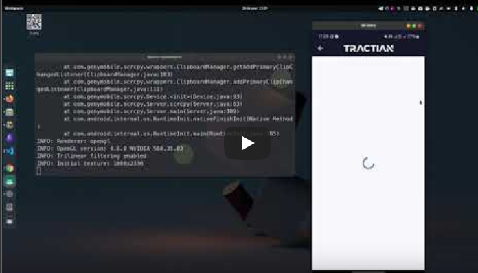

# Tractian Mobile Software Engineer Challenge

This app build an Tree View that shows companies Assets.

## Tech

Developed in [Flutter].

## ARCHITECTURE 

⚠️  [ARCHITECTURE](./ARCHITECTURE.md) for this app, the code comply with the ARCHITECTURE rules.

## Features

**1. Home Page**

- Is the menu for users to navigate between different companies and access  their assets.

**2. Asset Page**

- The Asset Tree is the core feature, offering a visual Tree representation of the company's asset hierarchy.
- **Sub-Features:**
    1. **Visualization**
        - Present a dynamic tree structure displaying components, assets, and locations.
    2. **Filters**
        
        **Text Search**
        
        - Users can search for specific components/assets/locations within the asset hierarchy.
        
        **Energy Sensors**
        
        - Implement a filter to isolate energy sensors within the tree.
        
        **Critical Sensor Status**
        
        - Integrate a filter to identify assets with critical sensor status.
    - When the filters are applied, the asset parents **can't** be hidden. The user must know the entire asset path. The items that are not related to the asset path, must be hidden


## Presentation

| [](https://youtu.be/cVyekOuV38c)            


## Points of Improvement for the Project
Given more time, there are several areas I would focus on to enhance the project:

1. Implementing Named Routes:

    - **Current Situation**: The project currently has two pages.
    - **Improvement**: Introduce a system with named routes to better manage navigation. This will make the code more maintainable and scalable, especially if more pages are added in the future.

2. Theming the Application:

    - **Current Situation**: The app uses a basic visual design.
    - **Improvement**: Create a comprehensive theme for the app, including custom colors, fonts, and styles. This will enhance the visual consistency and overall user experience.

3. Componentizing Widgets:

    - **Current Situation**: The AppBar and other widgets are not componentized.
    - **Improvement**: Break down the AppBar and other frequently used widgets into reusable components. This promotes code reusability and improves code organization.

4. Increasing Test Coverage and Improving Reports:

    - **Current Situation**: The project has limited test coverage.
    - **Improvement**: Expand the test coverage to include more unit tests, integration tests, and UI tests. Additionally, improve the reporting of test results to make it easier to track coverage and identify issues.

5. Enhancing Performance:

    - **Pagination**: If the data returned by the API is large, implement pagination to load and parse data in chunks. This will prevent performance bottlenecks and improve the user experience.
    - **Isolate for Heavy Computations**: For computationally intensive data manipulation, delegate these tasks to a separate isolate. Since Flutter runs on a single thread, performing heavy computations directly on the UI thread can make the app seem unresponsive. Offloading these tasks to an isolate will ensure smooth and responsive performance.

By addressing these points, the project would not only become more robust and maintainable but also deliver a superior user experience. Each of these improvements contributes to different aspects of the project, from navigation and theming to performance and testing, ensuring a well-rounded enhancement.


## Installation and Running

Install the dependencies and dev dependencies and run the project.

```sh
flutter pub get
flutter run
```

## Run Tests
Run all tests at once.

```sh
flutter test
```


## Building 

For production release follow the official Google Guide: [Flutter Build]

```sh
flutter build apk --split-per-abi
```


## License

MIT

[Flutter]: <https://flutter.dev/>
[Flutter Build]: <https://docs.flutter.dev/deployment/android>

